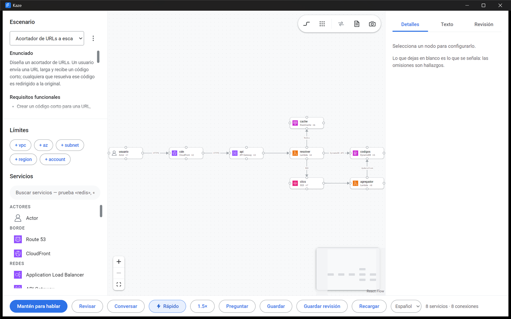

<div align="center">


# Kaze

**Practise AWS system design out loud, reviewed by the Claude Code you already have installed.**

</div>



Pick a scenario, draw the architecture with real AWS service icons, and ask for
a review — by voice or by button. Kaze serializes the diagram to text, hands it
to your local Claude Code session, and reads the verdict back to you while the
findings appear in a panel you can act on. Fix something, review again, and
watch a finding flip to **resolved**.

Or skip the drawing entirely: **conversation mode** turns the app into a
whiteboard partner. It frames the case, you say what to add, it draws.

---

## Contents

- [Features](#features)
- [Install](#install)
- [Requirements](#requirements)
- [How it works](#how-it-works)
- [Conversation mode](#conversation-mode)
- [Your data](#your-data)
- [Development](#development)
- [Keyboard](#keyboard)
- [Language](#language)

---

## Features

| | |
| --- | --- |
| **Canvas** | 30 AWS services with official icons, VPC/AZ/subnet boundaries, an Actor and a Custom node. Connections carry a protocol and a note, and attach to whichever side of a box faces the other one. |
| **Review** | Graded against a hidden rubric, not generic best practice. Five to eight findings, most severe first, spoken as well as written. |
| **Findings ledger** | Every finding is tracked as `new` / `open` / `resolved` / `regressed` across revisions, reconciled by the app rather than trusted from the model. |
| **Autofix** | Apply the change one finding calls for. The model proposes operations; the app validates and applies them, so a fix is something you can read in the diagram. |
| **Conversation mode** | Design out loud. Hands-free microphone, streamed speech, and the diagram as the only thing on screen. |
| **Fast mode** | A review in one round trip with no tools and no file reads — 7 s and $0.015, against 37 s and $0.183 for the full path. |
| **Voice** | OpenAI in and out, with an adjustable reading speed and a microphone picker. Entirely optional. |
| **Your own scenarios** | Describe a topic and Claude writes the brief *and* the hidden rubric. Scenarios are plain markdown in your workspace. |

---

## Install

```bash
npm install
npm run dist
```

Writes a per-user installer to `dist/` — `Kaze Setup <version>.exe` on Windows,
`.dmg` on macOS, `AppImage` on Linux. The Windows installer needs no
administrator, adds Start-menu and desktop entries, and uninstalls from
Settings.

The build is unsigned, so SmartScreen warns on first launch: **More info → Run
anyway**.

### From source

```bash
npm install
npm run dev
```

`npm run dev` reloads the renderer as you edit and restarts the main process
when it changes. `npm run build && npm start` runs the built app instead — the
same code the installer ships.

---

## Requirements

| | |
| --- | --- |
| **Node.js 20+** | to build. |
| **Claude Code, installed and logged in** | Kaze drives the `claude` on your `PATH` over your existing OAuth session. No API key, no second account, and sessions land in the same `~/.claude/projects/` store. If it cannot find yours it falls back to the SDK's bundled binary, which works but is a different build. |
| **An OpenAI API key** *(optional)* | Voice only. Paste it into the status bar; it is encrypted with the OS keystore and never leaves the main process. Without one the app still reviews, writes and draws — it just does not listen or speak, and conversation mode is unavailable. |

---

## How it works

**The reviewer is your Claude Code.** The app drives the CLI through the Agent
SDK with a deliberately narrow configuration: a read-only toolset
(`Read`, `Grep`, `Glob`, `Skill`), `settingSources: ['project']` so a review
never inherits the MCP servers configured on your machine, and `canUseTool` as
the allowlist rather than `allowedTools`, which a settings file can shadow. The
offered toolset is asserted on every session, not assumed.

**The diagram becomes text.** `kaze-adl` is a small YAML dialect carrying nodes,
edges, boundaries and configuration — plus a `gaps:` section the app computes
itself: unconnected nodes, untyped edges, single-AZ datastores, missing backup
policies, an entry point with no TLS. What you left out is what an interviewer
attacks, and it is not visible in a format that only lists what exists.

**Findings have identity.** A ledger on disk reconciles each review against the
last by pillar, node overlap and claim similarity, so a reworded finding is
still the same finding and a finding that merely stopped being raised is not
reported as fixed.

**The app decides, the model proposes.** Gaps are computed, not asked for.
Finding identity is the app's. Patches are validated against the service
manifest before anything is applied, and an operation that fails validation is
dropped with a reason rather than guessed at.

---

## Conversation mode

Press **Conversar** and everything except the diagram goes away. It opens by
framing the case, you answer out loud, and it draws what you agreed and asks
the next question.

The whole mode is built around one number — how long you sit in silence after
you stop talking:

| | |
| --- | --- |
| **One live CLI process** | Streaming input mode keeps the process and its context between turns. Starting a query per turn cost about two seconds before the first token. |
| **Speech streamed as it is generated** | Raw PCM scheduled straight onto an `AudioContext` clock. Waiting for the finished file cost about four seconds on a thirty-word reply. |
| **Speech before operations** | Synthesis starts the moment the spoken half of a reply ends, while the JSON is still arriving. |
| **Short replies, small prompts** | Capped at 25 words, with a compact inventory of the canvas rather than the full design. |

Measured end to end: **2.1 s** to the reply, **3.3 s** to the first word spoken.

The microphone is open except while the app is thinking or speaking. It does not
listen through its own voice — echo cancellation would probably hold, but
"probably" is the wrong word for a loop that could transcribe itself and reply
to itself. Hold **space** to talk regardless of what the voice detector thinks.

---

## Your data

Everything lives in your user data directory — `%APPDATA%/kaze/workspace` on
Windows, `~/Library/Application Support/kaze/workspace` on macOS:

```
workspace/
  scenarios/            briefs and their hidden rubrics, plain markdown
  attempts/default/     the current design, every numbered revision, the ledger
  attempts/archive/     attempts set aside with "Empezar de cero"
```

Nothing there is ever deleted by the app. Starting over moves an attempt into
`archive/` rather than removing it.

What leaves the machine: the serialized diagram and the scenario go to Claude
through your own Claude Code session; audio goes to OpenAI only if you have set
a key. The rubric is stripped in the main process before a brief ever reaches
the renderer — reading the answer key is not practising.

---

## Development

```bash
npm run dev          # electron-vite, with reload
npm run build        # typecheck + build to out/
npm run typecheck
npm run check        # 269 offline assertions across 10 suites
npm run check:live   # end-to-end review and the fix-and-resolve loop (costs money)
npm run check:voice  # speech round trip (needs OPENAI_API_KEY)
```

```
src/main/        session manager, live conversation session, voice, workspace, scenarios
src/preload/     the whole privileged surface the renderer gets
src/renderer/    React + React Flow canvas, panels, voice hooks
src/shared/      kaze-adl, gap rules, findings, ledger, patches, i18n
scripts/         the check suites, and a CDP driver for testing the running app
workspace/       the template shipped with the app: scenarios, CLAUDE.md, the review skill
```

The suites are plain scripts, not a framework: each prints its assertions in
prose and fails the build on the first one that does not hold. `PLAN.md` records
the design decisions and why each was made.

### Icons

Generated by the [`icongen`](https://github.com/Jibaru/skills/tree/main/icongen)
skill, not hand-drawn. `build/icons/icon.config.json` records every setting, so
the set rebuilds byte-identically:

```bash
node .agents/skills/icongen/scripts/icongen.mjs \n  --config build/icons/icon.config.json --out build/icons
```

---

## Keyboard

| | |
| --- | --- |
| Hold **Space** | review the current design |
| Hold **Shift+Space** | ask a question instead |
| Hold **Space** *(in conversation mode)* | talk regardless of the voice detector |
| **Ctrl+1 / 2 / 3** | inspector · design text · review |
| **Ctrl+Enter** | review without speaking |
| **Escape** | stop the turn |
| **Ctrl+S** | save |

---

## Language

The interface is Spanish by default and English is one click away in the status
bar. The reviewer answers in the interface language, including the spoken
summary, and speech is transcribed with the right language set.

AWS service names, node ids and the `kaze-adl` document written to disk stay in
English in both: they are proper nouns or machine-facing surface, and a design
serialized in Spanish would stop matching the findings that reference it.

---

## Design

The interface follows Google's developer-site system, taken from the values that
site ships rather than an impression of it: Roboto and Roboto Mono, self-hosted
so the app renders offline and its CSP stays closed to remote origins;
`#fff` / `#f8f9fa` / `#f1f3f4` surfaces, `#202124` text, `#1a73e8` primary,
Material elevation and pill-shaped actions.

Colour is two-tier — primitives name a value, semantic tokens name a job — and
every text pair is measured rather than judged. Two border roles exist because
they answer different questions: `--border` separates surfaces,
`--border-control` outlines inputs and clears the 3:1 non-text minimum.
